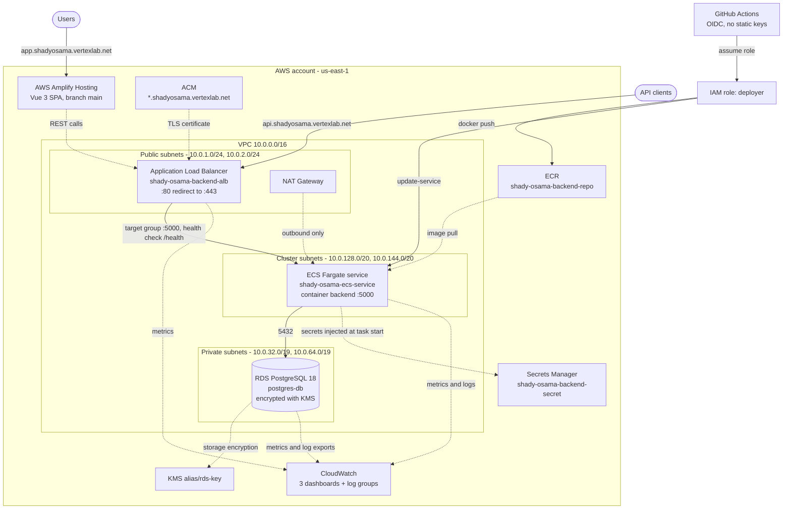
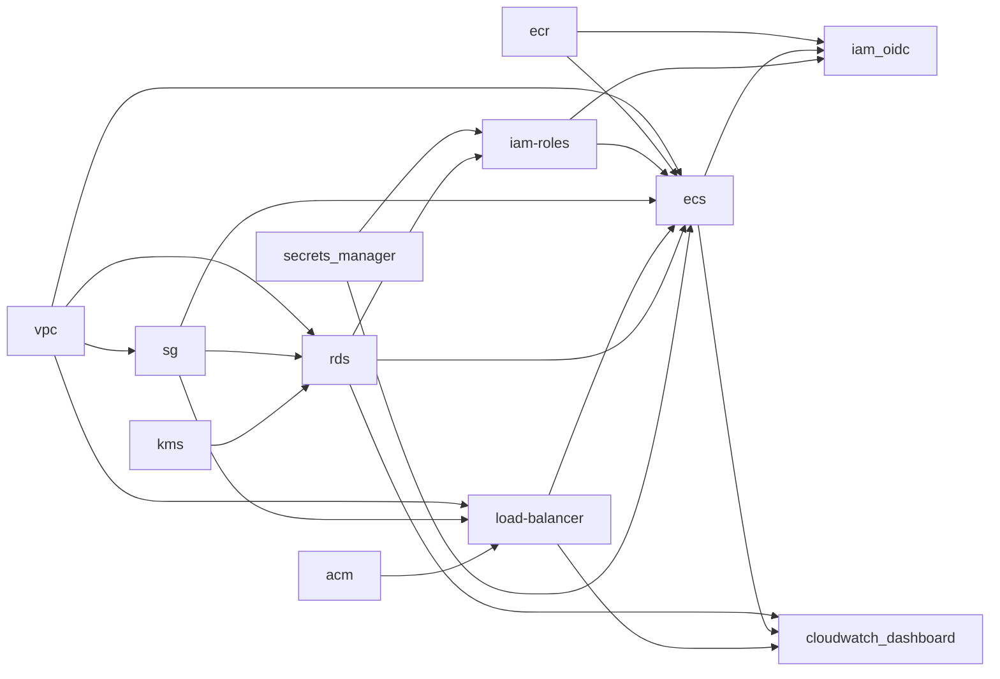

# final-task-iac

Production infrastructure as code for the **RealWorld** demo platform: a Flask
(PostgreSQL) API running on **ECS Fargate** behind an **Application Load
Balancer**, a **Vue 3** single-page app hosted on **AWS Amplify**, and the
supporting network, identity, encryption, registry and observability resources.

The repository is a **Terragrunt-orchestrated collection of reusable Terraform
modules**. Modules are version-controlled locally under `modules/`, and every
deployable component (a *stack*) lives under `envs/<environment>/<stack>/` with a
`terragrunt.hcl` that points at its module, declares its cross-stack
dependencies, and supplies the module inputs.

```text
Internet ──▶ Amplify Hosting (Vue 3 SPA)  ──┐
                                            │  https://api.shadyosama.vertexlab.net
Internet ──▶ ALB :443 (ACM wildcard cert) ──┴──▶ ECS Fargate :5000 ──▶ RDS PostgreSQL 18
                                                  (cluster subnets)     (private subnets, KMS)
GitHub Actions ──OIDC──▶ deployer role ──▶ ECR push ──▶ ECS rolling deploy
```

---

## Table of contents

1. [What gets deployed](#what-gets-deployed)
2. [Architecture](#architecture)
3. [Repository structure](#repository-structure)
4. [How the Terragrunt layering works](#how-the-terragrunt-layering-works)
5. [Module catalogue](#module-catalogue)
6. [Stacks and dependency graph](#stacks-and-dependency-graph)
7. [Production configuration reference](#production-configuration-reference)
8. [Prerequisites](#prerequisites)
9. [Bootstrap and deployment](#bootstrap-and-deployment)
10. [CI/CD integration](#cicd-integration)
11. [Conventions](#conventions)
12. [Validation and operations](#validation-and-operations)
13. [Security notes](#security-notes)
14. [Known gaps and roadmap](#known-gaps-and-roadmap)
15. [Extending the repository](#extending-the-repository)

---

## What gets deployed

| Layer | Service | Terraform stack | Notes |
| --- | --- | --- | --- |
| Network | VPC `10.0.0.0/16`, 6 subnets, IGW, 1 NAT gateway, 3 route tables | `vpc` | Public, private and dedicated "cluster" tiers across two AZs |
| Network security | 3 security groups with SG-to-SG references | `sg` | ALB (80/443), ECS (5000 from ALB), Postgres (5432 from ECS) |
| Encryption | KMS key + alias `rds-key`, 90-day rotation | `kms` | Encrypts RDS storage |
| Data | RDS PostgreSQL 18 `db.t3.micro`, encrypted, deletion-protected | `rds` | Private subnet group, custom parameter group, CloudWatch log exports |
| Secrets | Secrets Manager secret `shady-osama-backend-secret` | `secrets_manager` | Consumed by ECS as container `secrets` |
| Registry | ECR repository `shady-osama-backend-repo`, scan-on-push | `ecr` | Pulled by Fargate; pushed to by GitHub Actions |
| Edge/TLS | ACM wildcard certificate `*.shadyosama.vertexlab.net` (DNS validation) | `acm` | Terminates TLS on the ALB |
| Compute | ECS Fargate cluster, task definition, service `desired_count = 1` | `ecs` | `awsvpc` networking, ECS Exec enabled, logs to CloudWatch |
| Load balancing | Internet-facing ALB, target group `:5000`, HTTP→HTTPS redirect | `load-balancer` | Host-header rule for `*.shadyosama.vertexlab.net` |
| Identity (workload) | `ecs_task_execution_role`, `ecs_task_role` | `iam-roles` | Least-privilege secret/KMS access for the task |
| Identity (pipeline) | OIDC role `deployer` trusting GitHub Actions | `iam_oidc` | No long-lived AWS keys; scoped ECR push + ECS deploy |
| Frontend | Amplify app + `main` branch + custom domain `app.shadyosama.vertexlab.net` | `amplify` | `VITE_API_HOST` points at the ALB API domain |
| Observability | 3 CloudWatch dashboards (RDS, ECS, ALB) + log groups | `cloudwatch_dashboard` | Consumes outputs from `rds`, `ecs`, `load-balancer` |

---

## Architecture



**Request path**

1. Browsers reach the Vue 3 SPA on **Amplify Hosting**
   (`app.shadyosama.vertexlab.net`), built by Amplify from the application repository.
2. The SPA calls the API at `https://api.shadyosama.vertexlab.net`, which resolves to
   the internet-facing **ALB**.
3. The ALB terminates TLS with the **ACM wildcard certificate**. The HTTPS listener
   uses a **fail-closed default action** (a fixed `400 Bad request` response); traffic
   is only forwarded by the host-header **listener rule** to the target group.
4. The target group (`target_type = ip`, required for `awsvpc` Fargate tasks) forwards
   to the **ECS Fargate** container on port `5000` after health checks against `/health`.
5. The task resolves its `FLASK_*` and `POSTGRES_*` settings directly from
   **Secrets Manager** at container start (nothing sensitive is stored in the task
   definition or the image), then talks to **RDS PostgreSQL** inside the private subnets.

**Deployment path**

1. A push to `master` in the backend repository triggers GitHub Actions.
2. The workflow exchanges its GitHub OIDC token for temporary AWS credentials by
   assuming the Terraform-managed **`deployer`** role.
3. The image is built and pushed to **ECR** with a timestamp/SHA tag plus `latest`.
4. The existing task definition is re-rendered with the new image and rolled out to the
   ECS service with `wait-for-service-stability`.

> **Network segmentation in one line:** the ALB lives in the *public* subnets, the ECS
> tasks live in the *cluster* subnets (outbound-only via NAT), and RDS lives in the
> *private* subnets whose route table has **no default route at all**.

---

## Repository structure

```text
final-task-iac/
├── README.md
├── .gitignore
├── envs/
│   └── prod/                          # One directory per environment
│       ├── root.hcl                   # S3 remote state + generated AWS providers
│       ├── env.hcl                    # env / project locals + common tags
│       ├── vpc/terragrunt.hcl         # One directory per stack
│       ├── sg/terragrunt.hcl
│       ├── kms/terragrunt.hcl
│       ├── rds/terragrunt.hcl
│       ├── secrets_manager/terragrunt.hcl
│       ├── ecr/terragrunt.hcl
│       ├── acm/terragrunt.hcl
│       ├── load-balancer/terragrunt.hcl
│       ├── ecs/terragrunt.hcl
│       ├── iam-roles/terragrunt.hcl
│       ├── iam_oidc/terragrunt.hcl
│       ├── amplify/terragrunt.hcl
│       └── cloudwatch_dashboard/terragrunt.hcl
└── modules/                           # Reusable Terraform modules (13)
    ├── vpc/                           # vpc.tf, subnets.tf, routes.tf, nat.tf, igw.tf,
    │                                  # eip.tf, flow_logs.tf, gw_vpc_endpoint.tf,
    │                                  # locals.tf, variables.tf, outputs.tf, versions.tf
    ├── security-groups/               # main.tf, rules.tf, locals.tf, variables.tf, outputs.tf
    ├── kms/                           # main.tf, variables.tf, outputs.tf
    ├── rds/                           # main.tf, locals.tf, variables.tf, outputs.tf
    ├── secrets_manager/               # main.tf, variables.tf, outputs.tf, versions.tf
    ├── ecr/                           # main.tf, variables.tf, outputs.tf, versions.tf
    ├── acm/                           # main.tf, variables.tf, output.tf, versions.tf
    ├── load-balancer/                 # main.tf, listeners.tf, listener-rules.tf,
    │                                  # target-groups.tf, variables.tf, outputs.tf
    ├── ecs/                           # main.tf, task-definition.tf, service.tf,
    │                                  # variables.tf, outputs.tf
    ├── iam-roles/                     # main.tf, locals.tf, variable.tf, outputs.tf
    ├── iam-oidc/                      # main.tf, locals.tf, variables.tf, outputs.tf
    ├── amplify/                       # main.tf, locals.tf, variables.tf, outputs.tf
    └── cloudwatch_dashboard/          # main.tf, variables.tf
```

---

## How the Terragrunt layering works

Every stack composes three layers.

**1. `envs/prod/root.hcl` — shared backend and providers**

```hcl
remote_state {
  backend = "s3"
  config = {
    profile      = "skillup"
    bucket       = "final-task-state-files"
    key          = "${get_path_from_repo_root()}/terraform.tfstate"
    region       = "us-east-1"
    encrypt      = true
    use_lockfile = true   # S3-native state locking, no DynamoDB table
  }
}
```

`root.hcl` also **generates `provider.tf`** on every run, supplying a default `aws`
provider (`us-east-1`) plus an aliased `us_west_2` provider, both bound to the
`skillup` profile. Because the state key is derived from the stack path, every stack
gets its own state object, for example `envs/prod/ecs/terraform.tfstate`.

**2. `envs/prod/env.hcl` — environment identity and tags**

```hcl
locals {
  env     = "prod"
  project = "final-task"
  tags = {
    env        = local.env
    project    = local.project
    tf-managed = true
  }
}
```

**3. `envs/prod/<stack>/terragrunt.hcl` — the stack itself**

```hcl
terraform {
  source = "../../../modules/<module>"     # local module path, no registry
}

include "root" { path = "${get_parent_terragrunt_dir()}/../root.hcl" }
include "env" { path = find_in_parent_folders("env.hcl"); expose = true; merge_strategy = "no_merge" }
include "tags" { path = find_in_parent_folders("env.hcl"); expose = true; merge_strategy = "no_merge" }

dependency "vpc" {
  config_path  = "../vpc"
  mock_outputs = { vpc_ids = { main = "vpc-mock123" } }
}

inputs = {
  env     = include.env.locals.env
  project = include.env.locals.project
  tags    = include.tags.locals.tags
  # ...module-specific map(object) inputs
}
```

Two patterns are worth highlighting:

- **`mock_outputs`** on dependencies let a stack be planned in isolation (or before its
  dependency has been applied) without failing on missing outputs.
- **`dependency` blocks form the DAG.** Terragrunt derives apply/plan ordering from these
  declarations, so `terragrunt run --all` provisions in the correct sequence.

---

## Module catalogue

| Module | Resources created | Key outputs |
| --- | --- | --- |
| `vpc` | `aws_vpc`, `aws_subnet`, `aws_route_table`, `aws_route_table_association`, `aws_internet_gateway`, `aws_eip`, `aws_nat_gateway`, optional `aws_network_acl`, optional `aws_flow_log` + log group + IAM role/policy, optional gateway `aws_vpc_endpoint` | `vpc_ids`, `public_subnet_ids`, `private_subnet_ids`, `nat_gateway_ids`, `route_table_ids`, `vpc_endpoints` |
| `security-groups` | `aws_security_group`, `aws_vpc_security_group_ingress_rule`, `aws_vpc_security_group_egress_rule` | `security_group_ids` |
| `kms` | `aws_kms_key`, `aws_kms_alias` | `kms_key_ids`, `kms_key_arns` |
| `rds` | `aws_db_instance` (primary + optional read replicas), `aws_db_subnet_group`, `aws_db_parameter_group`, `aws_cloudwatch_log_group` | `db_endpoint`, `db_identifiers`, `rds_master_secret_arns`, `rds_usernames`, `subnet_group_names`, `replica_endpoints`, `replica_identifiers` |
| `secrets_manager` | `aws_secretsmanager_secret`, `aws_secretsmanager_secret_version` (with `ignore_changes = all`) | `secret_arn` |
| `ecr` | `aws_ecr_repository` with optional scan-on-push configuration | `repository_urls`, `repository_arns` |
| `acm` | `aws_acm_certificate` | `cert_arn`, `cert_validation_dns_records` |
| `load-balancer` | `aws_lb`, `aws_lb_target_group` (with health check), `aws_lb_listener`, `aws_lb_listener_rule` | `load_balancer_arns`, `load_balancer_dns_names`, `load_balancer_arn_suffixes`, `target_group_arns` |
| `ecs` | `aws_ecs_cluster`, `aws_ecs_task_definition`, `aws_ecs_service`, `aws_cloudwatch_log_group` | `task_definition_arns`, `ecs_service_arns`, `ecs_service_names`, `ecs_cluster_names` |
| `iam-roles` | `aws_iam_role`, `aws_iam_role_policy_attachment`, `aws_iam_role_policy` | `role_arns` |
| `iam-oidc` | `aws_iam_openid_connect_provider` (optional), `aws_iam_role` with `AssumeRoleWithWebIdentity` plus `aud`/`sub` conditions, policy attachments, inline policies | `role_arns`, `oidc_provider_arns` |
| `amplify` | `aws_amplify_app`, `aws_amplify_branch`, `aws_amplify_domain_association` | `branch_urls`, `app_arns` |
| `cloudwatch_dashboard` | `aws_cloudwatch_dashboard` | — |

All modules follow a **`for_each` over a `map(object(...))`** design, so one stack can
create many named resources of the same type (six subnets, three security groups, three
dashboards) from a single `inputs` block. Optional attributes are declared with
`optional(type, default)`, which makes each module's input contract self-documenting.

---

## Stacks and dependency graph

| Stack | Module | Direct dependencies |
| --- | --- | --- |
| `vpc` | `vpc` | — |
| `kms` | `kms` | — |
| `ecr` | `ecr` | — |
| `acm` | `acm` | — |
| `secrets_manager` | `secrets_manager` | — |
| `sg` | `security-groups` | `vpc` |
| `rds` | `rds` | `vpc`, `sg`, `kms` |
| `load-balancer` | `load-balancer` | `vpc`, `sg`, `acm` |
| `iam-roles` | `iam-roles` | `secrets_manager`, `rds` |
| `ecs` | `ecs` | `vpc`, `ecr`, `iam-roles`, `sg`, `load-balancer`, `rds`, `secrets_manager` |
| `iam_oidc` | `iam-oidc` | `ecr`, `ecs`, `iam-roles` |
| `amplify` | `amplify` | — (uses the Amplify-managed service role and a GitHub token) |
| `cloudwatch_dashboard` | `cloudwatch_dashboard` | `rds`, `ecs`, `load-balancer` |



Five root stacks (`vpc`, `kms`, `ecr`, `acm`, `secrets_manager`) have no dependencies and
are applied first; everything else fans out from them. Terragrunt resolves the full
ordering automatically, including the diamond where `rds` is needed by `iam-roles`,
`ecs` and `cloudwatch_dashboard`.

---

## Production configuration reference

All values below are the concrete inputs in `envs/prod/`.

### Network (`vpc`)

| Object | Value |
| --- | --- |
| VPC `main` | `10.0.0.0/16`, DNS hostnames + DNS support enabled, IGW created |
| `pub-sub-1` / `pub-sub-2` | `10.0.1.0/24` (us-east-1a) / `10.0.2.0/24` (us-east-1b), public IPs on launch |
| `priv-sub-1` / `priv-sub-2` | `10.0.32.0/19` (us-east-1a) / `10.0.64.0/19` (us-east-1b) |
| `cluster-sub-1` / `cluster-sub-2` | `10.0.128.0/20` (us-east-1a) / `10.0.144.0/20` (us-east-1b) |
| NAT | `nat_gw_1` in `pub-sub-1` using EIP `nat_eip` |
| Route tables | `pub_rt` → IGW (public subnets); `priv_rt` → **no routes** (private subnets); `cluster_rt` → NAT (cluster subnets) |
| NACLs | `create_nacl = false` on every subnet (the module supports them but none are created) |

### Security groups (`sg`)

| Security group | Ingress | Egress |
| --- | --- | --- |
| `postgres` | TCP 5432 from the `ecs` security group | all |
| `ecs` | TCP 5000 from the `load_balancer` security group | all |
| `load_balancer` | TCP 80 and 443 from `0.0.0.0/0` | all |

Ingress rules reference other security groups by **key** (`referenced_security_group_key`)
rather than by CIDR, so database and container traffic never depends on network ranges.

### Data (`rds`)

| Setting | Value |
| --- | --- |
| Identifier / engine | `postgres-db` / `postgres` `18` on `db.t3.micro` |
| Database / user | `nix` / `nix_admin`, `manage_master_user_password = true` (AWS-managed secret) |
| Storage | 20 GiB `gp2`, encrypted with the `rds` KMS key |
| Networking | subnet group `postgres-subnet-group` (`priv-sub-1`, `priv-sub-2`), `postgres` SG |
| Resilience | `multi_az = false`, backup retention 7 days, `deletion_protection = true`, no final-snapshot skip |
| Observability | Performance Insights on, `postgresql` logs exported to CloudWatch (7-day retention) |
| Parameter group | `postgres-params` (family `postgres18`): `log_connections=all`, `log_disconnections=1`, `log_min_duration_statement=1000`, `log_statement=ddl` |

### Compute (`ecs`)

| Setting | Value |
| --- | --- |
| Cluster / service | `shady-osama-ecs-cluster` / `shady-osama-ecs-service` |
| Task definition | family `shady-osama-ecs-task`, Fargate, `awsvpc`, 256 CPU / 512 MiB |
| Container | `backend`, image `<ECR repository URL>:latest`, port 5000 |
| Logs | `awslogs` → `/aws/ecs/shady-osama-ecs-task-logs/logs`, stream prefix `backend` |
| Secrets | `FLASK_APP`, `FLASK_ENV`, `FLASK_RUN_PORT`, `POSTGRES_HOST`, `POSTGRES_DB` from the `backend` secret; `POSTGRES_PASSWORD`, `POSTGRES_USER` from the RDS-managed master secret |
| Networking | `assign_public_ip = false`, subnets `cluster-sub-1`/`cluster-sub-2`, SG `ecs` |
| Deployment | `desired_count = 1`, min healthy 50% / max 200%, `force_new_deployment`, ECS Exec enabled |

### Edge (`acm`, `load-balancer`)

| Setting | Value |
| --- | --- |
| Certificate | `*.shadyosama.vertexlab.net` + SAN `shadyosama.vertexlab.net`, DNS validation |
| Load balancer | `shady-osama-backend-alb`, internet-facing, in `pub-sub-1`/`pub-sub-2` |
| Target group | `shady-osama-backend-tg`, HTTP `:5000`, `target_type = ip`, health check `GET /health` (200-299, 30s interval, 5s timeout, 2 healthy / 3 unhealthy) |
| Listeners | `:80` → `HTTP_301` redirect to HTTPS; `:443` with `ELBSecurityPolicy-2016-08` and a `400` fixed-response default action |
| Listener rule | priority 100, host headers `shadyosama.vertexlab.net` and `*.shadyosama.vertexlab.net` → forward to `tg` |

### Frontend (`amplify`)

| Setting | Value |
| --- | --- |
| App | `shady-osama-final-task-frontend`, repository `github.com/shadyosama9/vue3-realworld-example-app`, platform `WEB` |
| Branch | `main`, stage `PRODUCTION`, framework `VUE`, auto-build on |
| Branch env vars | `BASE_URL=/`, `VITE_API_HOST=https://api.shadyosama.vertexlab.net` |
| Domain | `shadyosama.vertexlab.net` with subdomain prefix `app` on branch `main`, `AMPLIFY_MANAGED` certificate |

### Pipeline trust (`iam_oidc`)

| Setting | Value |
| --- | --- |
| Provider | Pre-existing GitHub OIDC provider, referenced through `existing_oidc_providers` (not created by Terraform) |
| Role | `deployer`, audience `sts.amazonaws.com` |
| Subject | Pinned to the `production` GitHub environment of the backend repository |
| Inline policies | `ecr-push` (auth token plus push/pull scoped to the backend repository) and `ecs-deploy` (register task definition, update/describe service, `iam:PassRole` restricted to the two ECS roles with an `iam:PassedToService` condition) |

### Observability (`cloudwatch_dashboard`)

Three dashboards named `shady-osama-final-task-prod-<rds|ecs|load-balancer>`:

- **RDS**: CPU utilization, database connections, free storage space, freeable memory.
- **ECS**: CPU and memory utilization per cluster/service.
- **ALB**: request count, ELB 5XX, target 5XX, active connections (using the load balancer ARN suffix).

---

## Prerequisites

| Requirement | Notes |
| --- | --- |
| Terraform | `>= 1.10` (declared in the modules that carry a `versions.tf`). Developed with Terraform 1.16.x. |
| Terragrunt | Terragrunt 1.x. The configuration uses `get_path_from_repo_root()` and S3 `use_lockfile`, so a recent release is required. |
| AWS provider | `hashicorp/aws` version `6.62.0`, pinned in the modules that declare `required_providers` and in each stack's `.terraform.lock.hcl`. |
| AWS credentials | A named profile called **`skillup`** with permissions for VPC, EC2, IAM, KMS, RDS, Secrets Manager, ECR, ACM, ELBv2, ECS, Amplify and CloudWatch. |
| State bucket | An existing, private, encrypted S3 bucket named **`final-task-state-files`** in `us-east-1`. This repository does **not** create it (see below). |
| Python / pnpm / Docker | Only needed in the application repositories that build the image and the SPA. |

---

## Bootstrap and deployment

### 1. One-time bootstrap (not managed by this repository)

Create the remote-state bucket before the first `terragrunt init`:

```bash
aws s3api create-bucket \
  --bucket final-task-state-files \
  --region us-east-1

aws s3api put-bucket-versioning \
  --bucket final-task-state-files \
  --versioning-configuration Status=Enabled

aws s3api put-bucket-encryption \
  --bucket final-task-state-files \
  --server-side-encryption-configuration \
  '{"Rules":[{"ApplyServerSideEncryptionByDefault":{"SSEAlgorithm":"AES256"}}]}'

aws s3api put-public-access-block \
  --bucket final-task-state-files \
  --public-access-block-configuration \
  BlockPublicAcls=true,IgnorePublicAcls=true,BlockPublicPolicy=true,RestrictPublicBuckets=true
```

State locking uses S3 native lock files (`use_lockfile = true`), so no DynamoDB table
is required.

### 2. Authenticate

```bash
export AWS_PROFILE=skillup
aws sts get-caller-identity
```

### 3. Configure AWS Amplify access

The `amplify` module requires a GitHub token so Amplify can build the frontend
repository. Supply it through an environment variable rather than a checked-in file:

```bash
export TF_VAR_github_token=<github-token>   # requires repo + admin:repo_hook scope
```

The module also reads `modules/amplify/terraform.tfvars` when it exists. That file is
git-ignored (`*.tfvars`) and should **not** be committed — see
[Security notes](#security-notes).

### 4. Plan and apply a single stack

```bash
cd envs/prod/vpc
terragrunt init
terragrunt plan
terragrunt apply
```

For a stack with dependencies, either apply its dependencies first or let Terragrunt
resolve their state (mock outputs cover the "dependency not applied yet" case during
planning).

### 5. Plan and apply the whole environment

From the environment directory, Terragrunt walks the dependency graph:

```bash
cd envs/prod
terragrunt run --all -- plan
terragrunt run --all -- apply
```

> Terragrunt ≥ 0.90 uses `run --all -- <command>`; older releases accept
> `<command> --all`. Always review the plan before applying — this environment creates
> billable resources such as a NAT gateway, an ALB and an RDS instance.

To inspect the ordering before running anything:

```bash
cd envs/prod
terragrunt dag graph | dot -Tpng -o dag.png
```

### 6. Tear down

Destroy in reverse dependency order (`terragrunt run --all -- destroy`). Two settings
are intentionally hostile to accidental deletion and must be relaxed first:

- `deletion_protection = true` on the RDS instance,
- `skip_final_snapshot = false` on the RDS instance (destroy requires a final snapshot to
  succeed, so plan for that).

The ALB has `enable_deletion_protection = false`, so it can be destroyed directly.

---

## CI/CD integration

This repository provisions the **identity and the target platform**; the pipelines live
in the application repositories.

**Backend (`realworld-flask`, GitHub Actions → ECS)**

`.github/workflows/deploy-prod.yml` calls a reusable workflow on pushes to `master` and
passes the Terraform-managed names:

```yaml
ecs_task_definition_family: shady-osama-ecs-task
ecs_container_name: backend
ecs_cluster: shady-osama-ecs-cluster
ecs_service: shady-osama-ecs-service
```

The reusable workflow then:

1. requests an OIDC token (`permissions: id-token: write`) and assumes the `deployer`
   role created by the `iam_oidc` stack — **no long-lived AWS access keys**;
2. logs in to ECR and builds/pushes the image with a
   `<branch>-<timestamp>-<short-sha>` tag plus `latest`, using GitHub Actions caching;
3. downloads the current task definition, swaps the image, and deploys to the ECS
   service with `wait-for-service-stability: true`.

The `ecs` stack cooperates with this flow: the task definition ignores changes to
`container_definitions` and the service ignores changes to `task_definition`, so a
pipeline-registered revision is not reverted by the next `terraform apply`.

**Frontend (`vue3-realworld-example-app`, GitHub → Amplify)**

Amplify Hosting builds the branch on every push using `amplify.yml`
(`corepack enable`, `pnpm install --frozen-lockfile`, `pnpm build`, artifacts from
`dist/`). The branch environment variables injected by the `amplify` stack
(`BASE_URL=/`, `VITE_API_HOST=https://api.shadyosama.vertexlab.net`) point the SPA at the
ALB. The app's `environment_variables` block is ignored on subsequent applies so
console-side changes survive.

---

## Conventions

| Convention | Detail |
| --- | --- |
| Stack-per-component | One directory, one module, one state object, one responsibility. |
| Local module sources | `source = "../../../modules/<name>"`; no registry or Git sources. |
| Map-driven modules | Inputs are `map(object({...}))` with `optional()` defaults; resources use `for_each` keyed by the map key. |
| Key-based references | Cross-resource wiring uses map keys (`vpc_key`, `subnet_key`, `eip_key`, `nat_key`, `cluster_key`, `task_definition_key`, `parameter_group_key_name`, `db_subnet_group_key_name`, `referenced_security_group_key`) rather than raw IDs or names. |
| Naming | Shared/visible resources are prefixed `shady-osama-*`; Terraform-composed resources use `${project}-${env}-<key>-<suffix>` (KMS, EIP, NAT tag, IAM roles, subnet groups, NACLs, secrets, Amplify, OIDC providers, ECS log groups). |
| Tagging | A common tag map (`env`, `project`, `tf-managed = true`) flows from `env.hcl` into every module, merged with per-resource tags. |
| Input documentation | Every variable attribute carries an inline `# (Required)/(Optional)` comment describing type and default. |
| Secrets | Never in code: RDS uses an AWS-managed master password, and the app reads everything else from Secrets Manager at task start. |
| Optional dependencies | `mock_outputs` on `dependency` blocks keeps plans usable before dependencies exist. |
| Formatting | `terraform fmt` for `.tf` files, `terragrunt hcl fmt` for Terragrunt HCL. |

---

## Validation and operations

```bash
# Format Terraform code
terraform fmt -recursive

# Check formatting without writing
terraform fmt -check -recursive

# Format Terragrunt HCL in an environment
cd envs/prod && terragrunt hcl fmt

# Check Terragrunt HCL formatting without writing
cd envs/prod && terragrunt hcl fmt --check

# Lint every module
tflint --recursive

# Validate a single stack (initialises the module and providers first)
cd envs/prod/vpc && terragrunt validate

# Inspect the dependency DAG
cd envs/prod && terragrunt dag graph
```

`terragrunt validate` checks syntax and provider/module wiring only; it cannot confirm
AWS-side permissions, quotas or cross-stack values. Always run a plan.

**Day-2 operations**

| Task | How |
| --- | --- |
| Read application logs | CloudWatch log group `/aws/ecs/shady-osama-ecs-task-logs/logs` (7-day retention). |
| Read database logs | CloudWatch log groups `/aws/rds/instance/postgres-db/postgresql` (7-day retention). |
| Watch the platform | CloudWatch dashboards `shady-osama-final-task-prod-rds`, `-ecs`, `-load-balancer`. |
| Shell into a task | ECS Exec is enabled (`enable_execute_command = true`); the task role carries `AmazonSSMManagedInstanceCore`. |
| Rotate app secrets | Update the `shady-osama-backend-secret` value in Secrets Manager (the secret version has `ignore_changes = all`), then force a new ECS deployment. |
| Change the RDS password | Managed by AWS; read the RDS-managed secret ARN from `rds_master_secret_arns`. |
| Rotate the KMS key | Automatic rotation every 90 days is configured on `rds-key`. |
| Validate the certificate | DNS validation records are exposed by the `acm` stack output `cert_validation_dns_records`. |

---

## Security notes

**Identity**

- CI/CD uses **GitHub OIDC federation**; there are no long-lived AWS access keys in
  GitHub secrets. The `deployer` role pins both the audience (`sts.amazonaws.com`) and the
  **`sub` claim** to a specific repository *and* a specific GitHub environment, which
  prevents other repositories or branches from assuming it.
- The pipeline policy is least-privilege: ECR push/pull is scoped to the backend
  repository ARN, task-definition registration is scoped to the task-definition family,
  service updates are scoped to the single service ARN, and `iam:PassRole` is limited to
  the two ECS roles with an `iam:PassedToService` condition.
- The ECS task execution role can read only the two secrets it needs (with a `-*` suffix
  to cover versioned ARNs) and can decrypt only through the Secrets Manager service
  (`kms:ViaService` condition).

**Data**

- The RDS instance uses an **AWS-managed master password** stored in Secrets Manager, and
  the container receives it at task start. No credentials exist in the image, the task
  definition, or this repository.
- Storage is encrypted with a customer-managed KMS key that rotates every 90 days;
  deletion protection, 7-day backups and a mandatory final snapshot protect the data.
- The RDS instance sits in the private subnets whose route table has no default route, so
  it has no outbound internet path at all.

**Network**

- The database accepts 5432 only from the ECS security group and the API accepts 5000
  only from the load balancer security group — **security-group references instead of
  CIDRs**.
- The HTTPS listener's default action is a `400` fixed response, so unmatched hostnames
  are rejected instead of silently reaching the backend.
- Public ingress exists only on the load balancer (80/443).

**Secrets handling in this repository**

> ⚠️ **Action required.** `modules/amplify/terraform.tfvars` contains a plaintext GitHub
> personal access token. The file is **not tracked by git** (`.gitignore` excludes
> `*.tfvars`), but a real credential is sitting on disk and gets copied into
> `.terragrunt-cache` working directories on every run.
>
> - **Revoke that token** in GitHub and issue a new one.
> - Prefer `TF_VAR_github_token` from your shell profile or a CI secret store.
> - If you keep a local tfvars file, restrict it (`chmod 600`) and keep it untracked.
> - Never commit `*.tfvars` with credentials — the ignore rule is the only thing
>   protecting it today.

**Hardening opportunities** (not secrets, but worth tightening)

| Finding | Recommendation |
| --- | --- |
| Every security group allows all egress (`ip_protocol = "-1"`, `0.0.0.0/0`) | Restrict egress to the ports/destinations each tier needs. |
| The TLS listener uses `ELBSecurityPolicy-2016-08` | Move to a modern policy such as `ELBSecurityPolicy-TLS13-1-2-2021-06`. |
| `enable_execute_command = true` enables ECS Exec | Keep it, but restrict `ecs:ExecuteCommand` through IAM so it is not open to all principals. |
| The AWS account ID and repository identifiers are hardcoded in `envs/prod/iam_oidc/terragrunt.hcl` | Move them to `env.hcl` locals so the environment can be re-targeted without editing stacks. |
| ALB destroys without protection (`enable_deletion_protection = false`) | Enable it for production once the platform is stable. |
| No WAF, no ALB access logs, no VPC flow logs, no CloudTrail in this repo | The `vpc` module already supports flow logs — enabling them is a one-block change. |
| `shady-osama-backend-secret` starts as an empty JSON object | Populate `FLASK_APP`, `FLASK_ENV`, `FLASK_RUN_PORT`, `POSTGRES_HOST` and `POSTGRES_DB` before the ECS service starts, otherwise tasks will fail to boot. |

---

## Known gaps and roadmap

**Code hygiene**

- 9 of 13 modules have no `versions.tf`: `amplify`, `cloudwatch_dashboard`, `ecs`,
  `iam-oidc`, `iam-roles`, `kms`, `load-balancer`, `rds`, `security-groups`. `tflint`
  reports a missing `required_version` and provider version constraints for each. Add a
  `versions.tf` with `required_version >= "1.10"` and the pinned `hashicorp/aws 6.62.0`.
- `terraform fmt -check -recursive` currently reports 8 files needing formatting:
  `modules/amplify/terraform.tfvars`, `modules/ecs/outputs.tf`, `modules/ecs/service.tf`,
  `modules/load-balancer/outputs.tf`, `modules/load-balancer/variables.tf`,
  `modules/rds/main.tf`, `modules/rds/outputs.tf`, `modules/security-groups/variables.tf`.
- `terragrunt hcl fmt --check` currently reports 5 files needing formatting:
  `envs/prod/amplify/terragrunt.hcl`, `envs/prod/ecs/terragrunt.hcl`, `envs/prod/env.hcl`,
  `envs/prod/secrets_manager/terragrunt.hcl`, `envs/prod/sg/terragrunt.hcl`.
- Several stacks include the same `env.hcl` three times (`env`, `tags`, `project`); one
  include is enough, since `include.env.locals.project` and `include.tags.locals.tags` read
  the same file.
- `modules/iam-roles` uses `variable.tf` while every other module uses `variables.tf`, and
  `modules/acm` uses `output.tf` while the others use `outputs.tf`.

**Design and resilience**

| Gap | Impact |
| --- | --- |
| ECS `desired_count = 1` and no autoscaling | No redundancy; a task failure or a rolling deploy can cause downtime. |
| `multi_az = false` on RDS | Database outage with no automatic failover if the AZ fails. |
| A single NAT gateway in one AZ | Single point of failure for outbound cluster traffic, plus cross-AZ data charges. |
| No container insights on the ECS cluster | Only basic service-level metrics; no per-task CPU/memory detail. |
| Amplify uses `AMPLIFY_MANAGED` even though a wildcard ACM certificate exists | Two certificate authorities serve the same domain; consolidating would simplify DNS. |
| The Secrets Manager interface endpoint and several other module features are commented out | Tasks reach AWS APIs over the internet via NAT; endpoints would reduce exposure and cost. |
| Unused module capabilities: NACLs, VPC flow logs, gateway endpoints, RDS read replicas, ECR lifecycle policies, ECR repository policies, `random_password` | Documented but inactive — enable as requirements grow. |
| The Amplify module defines a per-app `access_token` attribute but reads the global `var.github_token` | Confusing input contract; pick one. |
| No state-bucket bootstrap and no CI workflow in this repository | State must be created manually, and there is no automated `fmt`/`validate` gate on pull requests. |

**Suggested next steps**

1. Revoke the GitHub token and remove `modules/amplify/terraform.tfvars` from the working
   tree (use `TF_VAR_github_token` instead).
2. Add `versions.tf` to the nine modules that lack one, then run
   `terraform fmt -recursive` and `cd envs/prod && terragrunt hcl fmt`.
3. Add a pull-request workflow running `terraform fmt -check -recursive`,
   `terragrunt hcl fmt --check`, and `tflint --recursive`.
4. Enforce a modern TLS policy and enable VPC flow logs, ALB access logs and CloudTrail.
5. Raise ECS `desired_count` to 2, add service autoscaling, and switch RDS to Multi-AZ.

---

## Extending the repository

**Add a stack for an existing module**

1. Create `envs/prod/<stack>/terragrunt.hcl`.
2. Set `terraform.source` to the module path (`../../../modules/<module>`).
3. Include `root.hcl` and `env.hcl`.
4. Add a `dependency` block for every output you consume, with `mock_outputs` so plans
   work before the dependency has been applied.
5. Supply the module inputs and run `terragrunt init && terragrunt plan` from that
   directory.

**Add an environment**

1. Copy `envs/prod` to `envs/<new-env>`.
2. Update `env.hcl` (`env`, `project`, tags).
3. Update `root.hcl` with a **distinct state key namespace or bucket** and, ideally, a
   distinct AWS account/profile.
4. Review every stack input: names, CIDRs, instance sizes, domains, and the OIDC `sub`
   claim (which embeds the GitHub environment name).
5. Never share a state key between environments.

---

## Related repositories

| Repository | Role |
| --- | --- |
| `realworld-flask` | Flask + PostgreSQL RealWorld API, containerised and deployed to ECS by GitHub Actions. |
| `vue3-realworld-example-app` | Vue 3 + Vite SPA, built and hosted by AWS Amplify. |
| `terraform-templates` | Upstream collection of reusable Terraform modules and Terragrunt patterns this project was assembled from. |

---

## License

No license file is included in this repository. Add one before distributing or reusing the
code outside the project.
